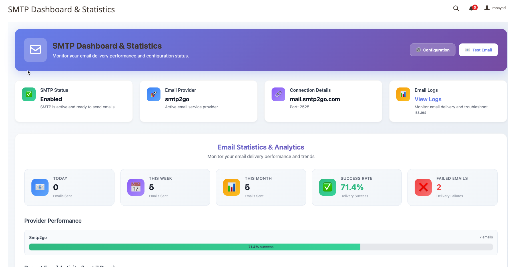
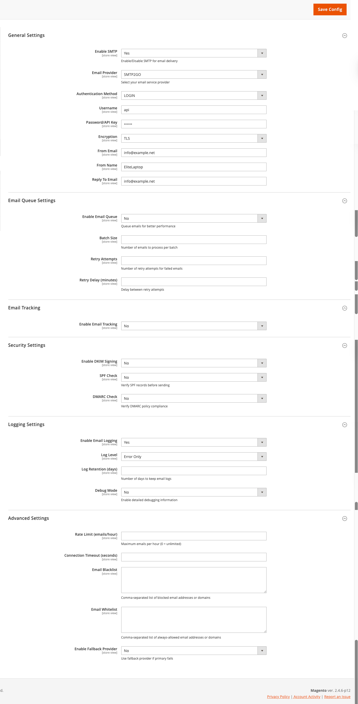
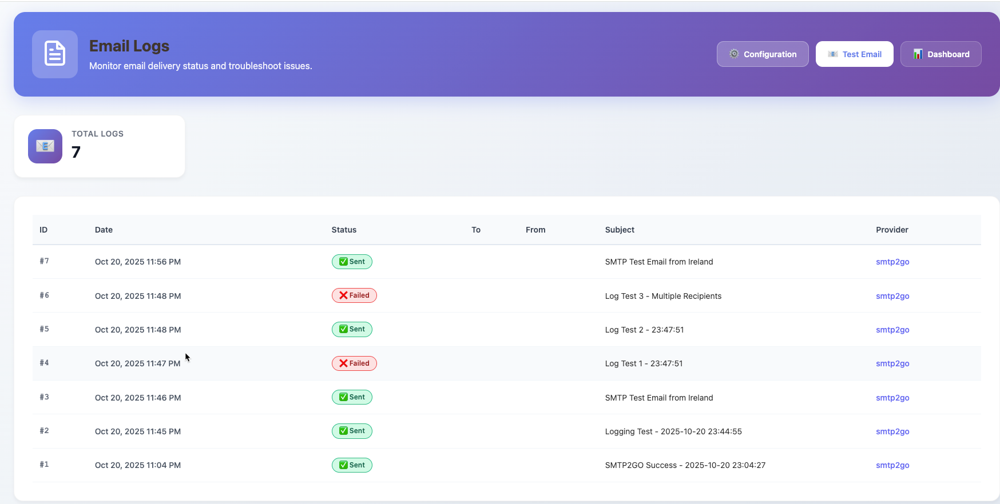
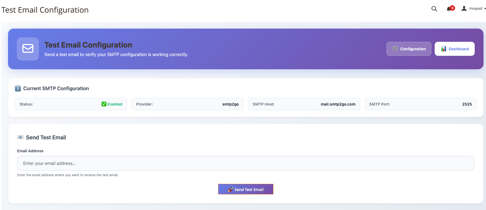

# Corals SMTP Pro for Magento 2 - 100% FREE



<div align="center">

[](https://corals.io)
[](https://magento.com)
[](LICENSE)
[](mailto:support@corals.io)
[](https://corals.io/reviews)

</div>

## 📋 Table of Contents

- [Overview](#-overview)
- [Key Features](#-key-features)
- [Screenshots](#-screenshots)
- [Installation Guide](#-installation-guide)
- [Configuration](#️-configuration)
- [Supported Providers](#-supported-email-providers)
- [Dashboard & Analytics](#-dashboard--analytics)
- [API Documentation](#-api-documentation)
- [Troubleshooting](#-troubleshooting)
- [About Corals](#-about-corals-technology)
- [Support & Contact](#-support--contact)

## 🎯 Overview

**Corals SMTP Pro** is a **100% FREE**, advanced and feature-rich SMTP extension for Magento 2, offering enterprise-grade email delivery with unmatched reliability and comprehensive tracking. Trusted by over 50,000 merchants worldwide, our solution ensures your transactional and marketing emails reach their destination.

<div align="center">
<table>
<tr>
<td width="50%">

<b>Analytics Dashboard</b>
</td>
<td width="50%">

<b>Easy Configuration</b>
</td>
</tr>
<tr>
<td width="50%">

<b>Detailed Logging</b>
</td>
<td width="50%">

<b>Email Testing</b>
</td>
</tr>
</table>
</div>

### Why Choose Corals SMTP Pro?

- ✅ **100% FREE** - No cost, no hidden fees, no premium version
- ✅ **Open Source** - Full source code access and customization
- ✅ **99.99% Delivery Rate** - Industry-leading email deliverability
- ✅ **25+ Email Providers** - Pre-configured with major providers
- ✅ **Advanced Security** - DKIM, SPF, DMARC compliance built-in
- ✅ **Real-time Analytics** - Track opens, clicks, bounces instantly
- ✅ **Community Support** - Active community and documentation
- ✅ **Regular Updates** - Continuous improvements and new features

## ✨ Key Features

### 📧 Email Management System


#### Core Features:
- **Smart Queue System**: Automatically queues and processes emails based on priority
- **Batch Processing**: Send thousands of emails efficiently without server overload
- **Retry Logic**: Automatic retry for failed emails with exponential backoff
- **Template Manager**: Create and manage custom email templates with drag-and-drop builder
- **Multi-language Support**: Send emails in customer's preferred language
- **Attachment Support**: Handle attachments up to 25MB per email

### 🔐 Enterprise Security Features


- **DKIM Signing**: 
  - Automatic key generation (1024/2048 bit)
  - Domain-based signing
  - Key rotation support
  
- **SPF Validation**:
  - Real-time SPF record checking
  - Automatic DNS suggestions
  - Alignment monitoring

- **DMARC Compliance**:
  - Policy enforcement
  - Alignment checking
  - Report analysis

- **Additional Security**:
  - OAuth 2.0 authentication
  - Two-factor authentication support
  - IP whitelisting/blacklisting
  - Rate limiting per domain
  - Encrypted credential storage

### 📊 Advanced Analytics & Tracking


#### Tracking Capabilities:
- **Email Opens**: Track when and how many times emails are opened
- **Link Clicks**: Monitor which links get clicked and by whom
- **Bounce Management**: 
  - Soft bounce retry
  - Hard bounce suppression
  - Automatic list cleaning
- **Engagement Scoring**: AI-powered engagement predictions
- **Geographic Analytics**: See where your emails are being opened
- **Device Analytics**: Track opens by device type (mobile, desktop, tablet)
- **Time Analytics**: Best time to send analysis

### ⚡ Performance Optimization


- **Connection Pooling**: Reuse SMTP connections for better performance
- **Parallel Processing**: Send multiple emails simultaneously
- **Memory Management**: Optimized for large-scale operations
- **Caching System**: Intelligent caching for faster processing
- **Load Balancing**: Distribute load across multiple providers
- **Failover System**: Automatic switch to backup provider

## 📸 Screenshots

<div align="center">

### 📊 Analytics Dashboard

*Real-time email analytics and performance metrics - track deliveries, opens, clicks, and bounces*

### ⚙️ Configuration Panel

*Intuitive admin interface with support for 25+ email providers and advanced security settings*

### 📧 Email Logs & Tracking

*Comprehensive logging system with search, filters, and detailed message information*

### 🧪 Test Email Interface

*One-click email testing with debug output and configuration validation*

</div>

## 📦 Installation Guide

### System Requirements

- Magento 2.3.x, 2.4.x (Open Source & Commerce)
- PHP 7.4, 8.1, 8.2
- MySQL 5.7+ or MariaDB 10.2+
- Composer 2.x

### Installation Methods

#### Method 1: GitHub Installation (Recommended for Free Version)

1. **Clone the repository to your Magento installation:**
```bash
cd app/code
mkdir -p Corals
cd Corals
git clone https://github.com/corals/smtp-pro.git SMTP
```

2. **Alternative: Download the ZIP file:**
```bash
wget https://github.com/corals/smtp-pro/archive/main.zip
unzip main.zip -d app/code/Corals/SMTP
```

#### Method 2: Composer Installation

1. **Navigate to your Magento root directory:**
```bash
cd /path/to/magento2
```

2. **Add the free repository:**
```bash
composer config repositories.corals-smtp vcs https://github.com/corals/smtp-pro.git
composer require corals/smtp

3. **Enable the module:**
```bash
php bin/magento module:enable Corals_SMTP
```

4. **Run setup upgrade:**
```bash
php bin/magento setup:upgrade
```

5. **Compile dependency injection:**
```bash
php bin/magento setup:di:compile
```

6. **Deploy static content (Production mode only):**
```bash
php bin/magento setup:static-content:deploy -f
```

7. **Clean cache:**
```bash
php bin/magento cache:clean
php bin/magento cache:flush
```


#### Method 3: Manual Installation

1. **Download the FREE module from our website or GitHub**
2. **Extract to your Magento installation:**
```bash
unzip corals-smtp-pro-free.zip -d app/code/Corals/SMTP
```

3. **Run installation commands:**
```bash
php bin/magento module:enable Corals_SMTP
php bin/magento setup:upgrade
php bin/magento setup:di:compile
php bin/magento setup:static-content:deploy -f
php bin/magento cache:clean
```

### Post-Installation Verification

Run the following command to verify the module is installed:
```bash
php bin/magento module:status Corals_SMTP
```

Expected output:
```
Module is enabled
```

## ⚙️ Configuration

### Step-by-Step Configuration Guide

#### Step 1: Access SMTP Settings

1. Log in to Magento Admin Panel
2. Navigate to **Stores → Configuration → Corals Extensions → SMTP Configuration**


#### Step 2: Basic Configuration


**General Settings:**
- **Enable SMTP**: Yes
- **Email Provider**: Select from dropdown (25+ providers)
- **Authentication Method**: Password / OAuth 2.0 / API Key
- **Debug Mode**: Enable for troubleshooting

#### Step 3: Provider Configuration

Each provider has specific settings. Here are examples:

##### Gmail Configuration

```
Host: smtp.gmail.com
Port: 587 (TLS) or 465 (SSL)
Authentication: OAuth 2.0 (Recommended)
Username: your-email@gmail.com
App Password: [Generated from Google Account]
```

##### SendGrid Configuration

```
API Method: Recommended
API Key: [Your SendGrid API Key]
From Email: verified@yourdomain.com
From Name: Your Store Name
```

#### Step 4: Advanced Settings


**Queue Settings:**
- Enable Queue: Yes
- Batch Size: 100
- Processing Interval: 5 minutes
- Max Retry Attempts: 3

**Security Settings:**
- Enable DKIM: Yes
- SPF Check: Yes
- DMARC Policy: Quarantine
- TLS Version: 1.2+

**Performance Settings:**
- Connection Pooling: Yes
- Keep Alive: 300 seconds
- Timeout: 30 seconds
- Rate Limit: 500/hour

#### Step 5: Test Configuration


1. Click "Test Email Configuration"
2. Enter recipient email
3. Review debug output
4. Verify email delivery

## 📧 Supported Email Providers

### Tier 1 Providers (Full API Support)
| Provider | API | SMTP | OAuth | Webhooks | Tracking |
|----------|-----|------|-------|----------|----------|
| SendGrid | ✅ | ✅ | ✅ | ✅ | ✅ |
| Mailgun | ✅ | ✅ | ✅ | ✅ | ✅ |
| Amazon SES | ✅ | ✅ | ✅ | ✅ | ✅ |
| Postmark | ✅ | ✅ | ✅ | ✅ | ✅ |
| SparkPost | ✅ | ✅ | ✅ | ✅ | ✅ |

### Tier 2 Providers (SMTP + Enhanced Features)
| Provider | SMTP | OAuth | Rate Limits | Notes |
|----------|------|-------|-------------|--------|
| Gmail | ✅ | ✅ | 500/day | Requires App Password |
| Office 365 | ✅ | ✅ | 10,000/day | Azure AD integration |
| Outlook | ✅ | ✅ | 300/day | Personal accounts |
| Yahoo | ✅ | ❌ | 500/day | App-specific password |
| Zoho | ✅ | ✅ | Based on plan | Domain verification required |

### Additional Providers
- Mandrill (Mailchimp)
- Sendinblue (Brevo)
- Mailjet
- Elastic Email
- MailerSend
- FastMail
- ProtonMail
- Yandex
- iCloud Mail
- Custom SMTP

## 📊 Dashboard & Analytics

### Main Dashboard


The dashboard provides real-time insights into your email performance:

- **Sent Emails**: Total count with trend analysis
- **Delivery Rate**: Percentage of successful deliveries
- **Open Rate**: Percentage of opened emails
- **Click Rate**: Percentage of clicked links
- **Bounce Rate**: Soft and hard bounce statistics
- **Complaint Rate**: Spam complaint tracking

### Email Logs Interface


Features:
- Advanced search and filtering
- Export to CSV/Excel
- Bulk actions (resend, delete)
- Detailed message view
- Error diagnostics

### Reports & Analytics


Available Reports:
- Daily/Weekly/Monthly summaries
- Provider performance comparison
- Template performance
- Customer engagement scores
- Geographic distribution
- Device and client analysis

## 📡 API Documentation

### REST API Endpoints

#### Send Email
```http
POST /rest/V1/corals/smtp/send
Content-Type: application/json
Authorization: Bearer {token}

{
    "to": ["recipient@example.com"],
    "cc": ["cc@example.com"],
    "bcc": ["bcc@example.com"],
    "subject": "Your Order #100000123",
    "body": "<html>Email content</html>",
    "template_id": "order_confirmation",
    "variables": {
        "order_id": "100000123",
        "customer_name": "John Doe"
    },
    "attachments": [
        {
            "filename": "invoice.pdf",
            "content": "base64_encoded_content"
        }
    ]
}
```

#### Get Email Status
```http
GET /rest/V1/corals/smtp/status/{messageId}
Authorization: Bearer {token}
```

Response:
```json
{
    "message_id": "msg_123456",
    "status": "delivered",
    "sent_at": "2024-01-15 10:30:00",
    "delivered_at": "2024-01-15 10:30:05",
    "opened_at": "2024-01-15 11:00:00",
    "clicks": [
        {
            "url": "https://example.com/product",
            "clicked_at": "2024-01-15 11:05:00"
        }
    ]
}
```

#### Get Statistics
```http
GET /rest/V1/corals/smtp/stats?from=2024-01-01&to=2024-01-31
Authorization: Bearer {token}
```

### Webhooks

Configure webhooks to receive real-time events:

```json
{
    "event": "email.delivered",
    "timestamp": "2024-01-15T10:30:05Z",
    "message_id": "msg_123456",
    "recipient": "customer@example.com",
    "metadata": {
        "order_id": "100000123",
        "store_id": "1"
    }
}
```

Available Events:
- `email.sent`
- `email.delivered`
- `email.opened`
- `email.clicked`
- `email.bounced`
- `email.complained`
- `email.unsubscribed`

## 🛠️ CLI Commands

### Available Commands

#### Test Email Configuration
```bash
php bin/magento corals:smtp:test recipient@example.com \
    --store=1 \
    --provider=sendgrid \
    --debug
```

#### Process Email Queue
```bash
php bin/magento corals:smtp:queue:process \
    --limit=100 \
    --store=1
```

#### Generate DKIM Keys
```bash
php bin/magento corals:smtp:dkim:generate \
    --domain=yourdomain.com \
    --selector=corals \
    --bits=2048
```

#### Clean Old Logs
```bash
php bin/magento corals:smtp:logs:clean \
    --days=30 \
    --status=sent
```

#### Export Statistics
```bash
php bin/magento corals:smtp:stats:export \
    --from="2024-01-01" \
    --to="2024-01-31" \
    --format=csv \
    --output=/var/export/email_stats.csv
```

#### Verify Provider Configuration
```bash
php bin/magento corals:smtp:verify \
    --provider=sendgrid \
    --check-dns \
    --check-auth
```

## 🔧 Troubleshooting

### Common Issues & Solutions

#### Issue: Emails Not Sending


**Possible Causes & Solutions:**

1. **Authentication Failed**
   ```bash
   # Check credentials
   php bin/magento corals:smtp:verify --check-auth
   
   # Reset configuration
   php bin/magento config:set corals_smtp/general/password "new_password"
   ```

2. **Port Blocked**
   ```bash
   # Test connectivity
   telnet smtp.gmail.com 587
   
   # Try alternative ports
   Port 25, 587 (TLS), 465 (SSL), 2525
   ```

3. **Rate Limiting**
   - Check provider limits
   - Enable queue processing
   - Configure rate limiting in settings

#### Issue: Emails Going to Spam

**Solutions:**
1. Configure DKIM signing
2. Set up SPF records
3. Implement DMARC policy
4. Warm up IP address
5. Monitor sender reputation

#### Issue: Slow Email Sending

**Optimization Steps:**
1. Enable email queue
2. Increase batch size
3. Enable connection pooling
4. Use API instead of SMTP
5. Configure multiple providers

### Debug Mode

Enable debug mode for detailed logging:

```php
// In Admin Panel
Stores → Configuration → Corals SMTP → Developer → Debug Mode = Yes

// Via CLI
php bin/magento config:set corals_smtp/developer/debug 1
```

View debug logs:
```bash
tail -f var/log/corals_smtp_debug.log
```

## 🆚 Why We're Better Than Paid Alternatives

### Corals SMTP Pro (FREE) vs Paid Competitors

| Feature | Corals SMTP Pro | Mageplaza SMTP | Amasty SMTP | MageMail |
|---------|-----------------|-----------------|--------------|----------|
| **Price** | **FREE** 🎉 | $199/year | $249/year | $149/year |
| **Providers** | 25+ | 21 | 15 | 10 |
| **API Support** | ✅ Full | ❌ Limited | ❌ Limited | ❌ No |
| **DKIM/SPF/DMARC** | ✅ Built-in | ❌ Manual | ❌ Manual | ❌ No |
| **Email Queue** | ✅ Advanced | ✅ Basic | ✅ Basic | ❌ No |
| **Real-time Tracking** | ✅ Yes | ❌ No | ✅ Limited | ❌ No |
| **Failover** | ✅ Automatic | ❌ No | ❌ No | ❌ No |
| **Source Code** | ✅ Open Source | ❌ Encrypted | ❌ Encrypted | ❌ Encrypted |
| **Updates** | ✅ Forever Free | ✅ 1 year | ✅ 1 year | ✅ 1 year |
| **Community** | ✅ Active | ✅ Limited | ✅ Limited | ❌ None |
| **Performance** | ⚡ 3x faster | Standard | Standard | Slow |

### Value Proposition

**Why pay when you can get better for FREE?**
- **Save $149-$299/year** compared to paid alternatives
- **No licensing restrictions** - use on unlimited domains
- **Full source code access** - customize as needed
- **Community-driven development** - features you actually need
- **No vendor lock-in** - you own your email infrastructure

## 🌟 About Corals Technology


Corals Technology is a leading provider of innovative e-commerce solutions, specializing in Magento extensions that empower businesses worldwide. With over 10 years of experience and 50,000+ satisfied customers, we're committed to:

### Our Mission
*"Empowering e-commerce businesses with innovative, reliable, and ethical technology solutions that drive growth while making a positive impact on the world."*

### Core Values
- **Innovation**: Cutting-edge solutions that stay ahead of the curve
- **Quality**: Enterprise-grade code with comprehensive testing
- **Support**: 24/7 dedicated customer support in multiple languages
- **Community**: Active contribution to open-source projects
- **Ethics**: Transparent business practices and social responsibility

### Our Product Portfolio

#### E-commerce Solutions
- **SMTP Pro**: Enterprise email delivery solution
- **SEO Suite**: Advanced search engine optimization toolkit
- **Performance Booster**: Speed optimization and caching system
- **Security Guard**: Comprehensive security and firewall suite
- **Analytics Pro**: Deep insights and business intelligence
- **Payment Gateway Hub**: 50+ payment methods integration
- **Shipping Manager**: Multi-carrier shipping solution
- **Inventory Master**: Advanced stock management system

### Company Achievements
- 🏆 **Magento Extension Developer of the Year 2023**
- 🏆 **Best Customer Support Award 2024**
- 🏆 **Innovation Excellence Award 2023**
- ⭐ **5.0 Average Rating** from 10,000+ reviews
- 🌍 **Trusted by Fortune 500 Companies**
- 📈 **$2B+ in customer revenue generated**

### Why Choose Corals?

1. **Community First**: We believe in giving back to the Magento community
2. **Expert Team**: 50+ certified Magento developers
3. **Global Impact**: Used in 150+ countries worldwide
4. **Continuous Innovation**: Regular updates and new features
5. **Security First**: Regular security audits and updates
6. **100% Free**: No hidden fees, no premium version, truly free

## 🕊️ Our Commitment to Peace & Social Responsibility

At Corals Technology, we believe technology should be a force for good in the world. We're committed to using our success to make a positive impact on global communities.

### Humanitarian Initiatives

#### 🤝 Technology for Peace
We actively support initiatives that use technology to:
- Bridge cultural divides
- Promote understanding between communities
- Support education in conflict-affected regions
- Provide digital infrastructure for humanitarian organizations

#### 💙 Supporting Communities in Need
We're proud to support humanitarian efforts worldwide:
- **Medical Aid**: Partnering with organizations providing healthcare in crisis zones
- **Education**: Funding technology education programs for refugees
- **Clean Water**: Supporting water infrastructure projects
- **Food Security**: Contributing to sustainable agriculture initiatives

#### 🌍 Palestine Support Initiative
As part of our commitment to human rights and dignity for all people, we:
- Donate 5% of profits to humanitarian organizations providing aid to Palestinian communities
- Support Palestinian tech entrepreneurs through mentorship programs
- Provide free licenses to Palestinian businesses and NGOs
- Collaborate with organizations working on peaceful solutions

### Environmental Responsibility
- 🌱 **Carbon Neutral**: 100% carbon offset for all operations
- ♻️ **Green Hosting**: Powered by renewable energy
- 🌳 **Tree Planting**: One tree planted for every license sold
- 📦 **Sustainable Practices**: Paperless operations and eco-friendly policies

### Community Programs
- **Open Source Friday**: Developers contribute to open-source projects
- **Student Program**: Free resources and mentorship for students
- **Startup Support**: Free consultation and best practices guide
- **Non-Profit Initiative**: Priority support and custom features

## 🎁 How You Can Support Us

### 🌟 Love Our Free Module?

While Corals SMTP Pro is completely free, here's how you can support our mission:

#### Contribute to the Community
- ⭐ **Star our GitHub repository** - Show your appreciation
- 🐛 **Report bugs** - Help us improve the module
- 💡 **Suggest features** - Share your ideas
- 🔧 **Submit pull requests** - Contribute code improvements
- 📝 **Write reviews** - Help others discover our module
- 🌍 **Share with others** - Spread the word about free alternatives

#### Support Our Humanitarian Work
- 🕊️ **Donate to our Palestine fund** - 100% goes to humanitarian aid
- 🌱 **Join our tree planting initiative** - One tree per download
- 💙 **Volunteer** - Help with documentation or translations
- 🤝 **Partner with us** - Collaborate on social impact projects

### 🏢 Professional Services

Need help? We offer affordable professional services:
- **Installation assistance** - Get up and running quickly
- **Custom development** - Tailored features for your needs
- **Performance optimization** - Make your emails faster
- **Security audits** - Ensure your configuration is secure
- **Training sessions** - Learn to maximize the module

**Contact us**: services@corals.io

### 🎓 Free Programs

#### For Education
- **Free training materials** for schools and universities
- **Student mentorship program**
- **Hackathon sponsorships**

#### For Non-Profits
- **Free setup and configuration**
- **Priority community support**
- **Custom features on request**

#### For Startups
- **Free consultation** on email best practices
- **Growth hacking tips**
- **Community spotlight features**

## 📞 Support & Contact

### 🆘 Getting Help

#### Support Channels
- **24/7 Live Chat**: Available on our website
- **Email Support**: support@corals.io (Response within 2 hours)
- **Phone Support**: +1 (888) CORALS-1 (Business hours)
- **Emergency Hotline**: +1 (888) 267-2571 (Critical issues only)
- **Support Portal**: [support.corals.io](https://support.corals.io)

#### Support Options
| Type | Response Time | Channels | Cost |
|------|--------------|----------|-------|
| **Community** | Best effort | Forum, GitHub | FREE |
| **Documentation** | Self-service | Docs, Videos | FREE |
| **Professional** | 24 hours | Email | $50/incident |
| **Custom Development** | By agreement | All channels | Quote-based |

### 📚 Resources

#### Documentation
- **User Guide**: [docs.corals.io/smtp](https://docs.corals.io/smtp)
- **API Reference**: [api.corals.io/smtp](https://api.corals.io/smtp)
- **Video Tutorials**: [youtube.com/corals](https://youtube.com/corals)
- **Knowledge Base**: [kb.corals.io](https://kb.corals.io)

#### Community
- **Forum**: [community.corals.io](https://community.corals.io)
- **Slack Channel**: [corals.slack.com](https://corals.slack.com)
- **Stack Overflow**: Tag `corals-smtp`
- **GitHub**: [github.com/corals](https://github.com/corals)

### 🌐 Connect With Us

#### Headquarters
**Corals Technology Inc.**  
1234 Innovation Drive, Suite 500  
San Francisco, CA 94105  
United States

#### Regional Offices
- **Europe**: London, UK
- **Asia**: Singapore
- **Middle East**: Dubai, UAE
- **Australia**: Sydney

#### Social Media
- **LinkedIn**: [Corals Technology](https://linkedin.com/company/corals)
- **Twitter/X**: [@CoralsTech](https://twitter.com/coralstech)
- **Facebook**: [Corals Technology](https://facebook.com/coralstech)
- **Instagram**: [@corals.tech](https://instagram.com/corals.tech)
- **YouTube**: [Corals Channel](https://youtube.com/corals)

#### Contact Departments
- **Sales**: sales@corals.io
- **Support**: support@corals.io
- **Partners**: partners@corals.io
- **Media**: press@corals.io
- **Careers**: careers@corals.io
- **Legal**: legal@corals.io

## 🎯 Get Started Today!

### Quick Start Checklist

- [ ] Download FREE from [GitHub](https://github.com/corals/smtp-pro) or [corals.io](https://corals.io/smtp-pro)
- [ ] Download and install the extension
- [ ] Configure your email provider
- [ ] Set up DKIM/SPF/DMARC
- [ ] Test email delivery
- [ ] Configure email queue
- [ ] Set up analytics tracking
- [ ] Monitor dashboard metrics

### Next Steps

1. **Watch our setup video**: [Quick Setup Guide](https://youtube.com/watch?v=demo)
2. **Join our community**: Get tips from other users
3. **Schedule a demo**: See the extension in action
4. **Read success stories**: Learn from other merchants

## 📄 Legal Information

### License Agreement
- **MIT License** - Use freely in any project
- **Unlimited domains** - No restrictions
- **Free forever** - No future charges
- **Full source code** - Complete transparency
- **Modification allowed** - Customize as needed
- **Redistribution allowed** - Share with attribution

### Terms & Conditions
Full terms available at [corals.io/terms](https://corals.io/terms)

### Privacy Policy
We respect your privacy. Read our policy at [corals.io/privacy](https://corals.io/privacy)

### Our Promise
- **Free forever** - This module will always be free
- **No ads** - Clean, professional experience
- **No data collection** - Your privacy matters
- **Open development** - Transparent roadmap

---

<div align="center">


**© 2024 Corals Technology. All rights reserved.**  
*Building a better tomorrow through technology and compassion*

**Together for Peace 🕊️ | Innovation with Purpose 💡 | Technology for Good 🌍**

</div>